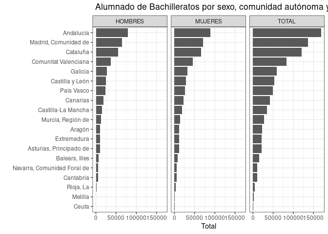

# mefdind

**mefdind** es un paquete con herramientas para manejar las bases de
datos con
[indicadores](https://www.educacionyfp.gob.es/servicios-al-ciudadano/estadisticas/no-universitaria.html)
del Ministerio de Educación, Formación Profesional y Deportes (MEFD) de
Españá. Las funciones permiten leer, descargar, y seleccionar las bases
de datos con indicadores.

## Instalación

Hay dos maneras de instalarlo.

### CRAN

Una es la versión estable en CRAN:

``` r
install.packages("mefdind")
```

### GitHub

La otra es la versión en desarrollo en GitHub:

``` r
library("devtools")
install_github("eldafani/mefdind")
```

## Nombre de archivos

``` r
mi_url <-"https://estadisticas.educacion.gob.es/EducaDynPx/educabase/index.htm?type=pcaxis&path=/no-universitaria/centros/centrosyunid/series/unidades_esc&file=pcaxis&l=s0"
mefd_name(mi_url)
#>  [1] "series_1_01.csv" "series_1_02.csv" "series_1_03.csv" "series_1_04.csv"
#>  [5] "series_1_05.csv" "series_1_06.csv" "series_1_07.csv" "series_1_08.csv"
#>  [9] "series_1_09.csv" "series_1_10.csv" "series_2_01.csv" "series_2_02.csv"
#> [13] "series_2_03.csv" "series_2_04.csv" "series_2_05.csv" "series_2_06.csv"
#> [17] "series_2_07.csv" "series_2_08.csv" "series_2_09.csv" "series_2_10.csv"
```

## urls de bases de datos

``` r
mi_url <- "https://estadisticas.educacion.gob.es/EducaDynPx/educabase/index.htm?type=pcaxis&path=/no-universitaria/centros/sice/series&file=pcaxis&l=s0"
mefd_url(mi_url)
#>  [1] "https://estadisticas.educacion.gob.es/EducaJaxiPx/files/_px/es/csv_bdsc/no-universitaria/centros/sice/series/l0/series_1_1.csv_bdsc?nocab=1"
#>  [2] "https://estadisticas.educacion.gob.es/EducaJaxiPx/files/_px/es/csv_bdsc/no-universitaria/centros/sice/series/l0/series_1_2.csv_bdsc?nocab=1"
#>  [3] "https://estadisticas.educacion.gob.es/EducaJaxiPx/files/_px/es/csv_bdsc/no-universitaria/centros/sice/series/l0/series_1_3.csv_bdsc?nocab=1"
#>  [4] "https://estadisticas.educacion.gob.es/EducaJaxiPx/files/_px/es/csv_bdsc/no-universitaria/centros/sice/series/l0/series_1_4.csv_bdsc?nocab=1"
#>  [5] "https://estadisticas.educacion.gob.es/EducaJaxiPx/files/_px/es/csv_bdsc/no-universitaria/centros/sice/series/l0/series_1_5.csv_bdsc?nocab=1"
#>  [6] "https://estadisticas.educacion.gob.es/EducaJaxiPx/files/_px/es/csv_bdsc/no-universitaria/centros/sice/series/l0/series_2_1.csv_bdsc?nocab=1"
#>  [7] "https://estadisticas.educacion.gob.es/EducaJaxiPx/files/_px/es/csv_bdsc/no-universitaria/centros/sice/series/l0/series_2_2.csv_bdsc?nocab=1"
#>  [8] "https://estadisticas.educacion.gob.es/EducaJaxiPx/files/_px/es/csv_bdsc/no-universitaria/centros/sice/series/l0/series_2_3.csv_bdsc?nocab=1"
#>  [9] "https://estadisticas.educacion.gob.es/EducaJaxiPx/files/_px/es/csv_bdsc/no-universitaria/centros/sice/series/l0/series_2_4.csv_bdsc?nocab=1"
#> [10] "https://estadisticas.educacion.gob.es/EducaJaxiPx/files/_px/es/csv_bdsc/no-universitaria/centros/sice/series/l0/series_2_5.csv_bdsc?nocab=1"
#> [11] "https://estadisticas.educacion.gob.es/EducaJaxiPx/files/_px/es/csv_bdsc/no-universitaria/centros/sice/series/l0/series_2_6.csv_bdsc?nocab=1"
#> [12] "https://estadisticas.educacion.gob.es/EducaJaxiPx/files/_px/es/csv_bdsc/no-universitaria/centros/sice/series/l0/series_3_1.csv_bdsc?nocab=1"
#> [13] "https://estadisticas.educacion.gob.es/EducaJaxiPx/files/_px/es/csv_bdsc/no-universitaria/centros/sice/series/l0/series_3_2.csv_bdsc?nocab=1"
#> [14] "https://estadisticas.educacion.gob.es/EducaJaxiPx/files/_px/es/csv_bdsc/no-universitaria/centros/sice/series/l0/series_3_3.csv_bdsc?nocab=1"
```

## Metadatos de indicadores

Generar metadata a partir de la web

``` r
mi_url <-"https://estadisticas.educacion.gob.es/EducaDynPx/educabase/index.htm?type=pcaxis&path=/no-universitaria/centros/centrosyunid/series/unidades_esc&file=pcaxis&l=s0"
df <- mefd_meta(mi_url)
head(df)
#>                                                                                                  indicador
#> 1                Unidades de E. Infantil por titularidad del centro, comunidad autónoma y curso académico.
#> 2   Unidades de E. Infantil Primer ciclo por titularidad del centro, comunidad autónoma y curso académico.
#> 3  Unidades de E. Infantil Segundo ciclo por titularidad del centro, comunidad autónoma y curso académico.
#> 4                Unidades de E. Primaria por titularidad del centro, comunidad autónoma y curso académico.
#> 5                Unidades de E. Especial por titularidad del centro, comunidad autónoma y curso académico.
#> 6                        Unidades de ESO por titularidad del centro, comunidad autónoma y curso académico.
#>           archivo
#> 1 series_1_01.csv
#> 2 series_1_02.csv
#> 3 series_1_03.csv
#> 4 series_1_04.csv
#> 5 series_1_05.csv
#> 6 series_1_06.csv
#>                                                                                                                                                                 url
#> 1 https://estadisticas.educacion.gob.es/EducaJaxiPx/files/_px/es/csv_bdsc/no-universitaria/centros/centrosyunid/series/unidades_esc/l0/series_1_01.csv_bdsc?nocab=1
#> 2 https://estadisticas.educacion.gob.es/EducaJaxiPx/files/_px/es/csv_bdsc/no-universitaria/centros/centrosyunid/series/unidades_esc/l0/series_1_02.csv_bdsc?nocab=1
#> 3 https://estadisticas.educacion.gob.es/EducaJaxiPx/files/_px/es/csv_bdsc/no-universitaria/centros/centrosyunid/series/unidades_esc/l0/series_1_03.csv_bdsc?nocab=1
#> 4 https://estadisticas.educacion.gob.es/EducaJaxiPx/files/_px/es/csv_bdsc/no-universitaria/centros/centrosyunid/series/unidades_esc/l0/series_1_04.csv_bdsc?nocab=1
#> 5 https://estadisticas.educacion.gob.es/EducaJaxiPx/files/_px/es/csv_bdsc/no-universitaria/centros/centrosyunid/series/unidades_esc/l0/series_1_05.csv_bdsc?nocab=1
#> 6 https://estadisticas.educacion.gob.es/EducaJaxiPx/files/_px/es/csv_bdsc/no-universitaria/centros/centrosyunid/series/unidades_esc/l0/series_1_06.csv_bdsc?nocab=1
#>                                                          titulo
#> 1 ENSEÑANZAS NO UNIVERSITARIAS / CENTROS Y SERVICIOS EDUCATIVOS
#> 2 ENSEÑANZAS NO UNIVERSITARIAS / CENTROS Y SERVICIOS EDUCATIVOS
#> 3 ENSEÑANZAS NO UNIVERSITARIAS / CENTROS Y SERVICIOS EDUCATIVOS
#> 4 ENSEÑANZAS NO UNIVERSITARIAS / CENTROS Y SERVICIOS EDUCATIVOS
#> 5 ENSEÑANZAS NO UNIVERSITARIAS / CENTROS Y SERVICIOS EDUCATIVOS
#> 6 ENSEÑANZAS NO UNIVERSITARIAS / CENTROS Y SERVICIOS EDUCATIVOS
```

Leer metadata general disponible en el paquete

``` r
head(meta_mefd)
#>                                                                                                      indicador
#> 1  Alumnado de Enseñanzas de Régimen General por titularidad del centro, comunidad autónoma y curso académico.
#> 2                    Alumnado de Enseñanzas de Régimen General por sexo, comunidad autónoma y curso académico.
#> 3                    Alumnado de E. Infantil por titularidad del centro, comunidad autónoma y curso académico.
#> 4                                      Alumnado de E. Infantil por sexo, comunidad autónoma y curso académico.
#> 5    Alumnado de Primer ciclo de E. Infantil por titularidad del centro, comunidad autónoma y curso académico.
#> 6   Alumnado de Segundo ciclo de E. Infantil por titularidad del centro, comunidad autónoma y curso académico.
#>             archivo
#> 1 alumnado_1_01.csv
#> 2 alumnado_1_02.csv
#> 3 alumnado_2_01.csv
#> 4 alumnado_2_02.csv
#> 5 alumnado_2_03.csv
#> 6 alumnado_2_04.csv
#>                                                                                                                                                                   url
#> 1 https://estadisticas.educacion.gob.es/EducaJaxiPx/files/_px/es/csv_bdsc/no-universitaria/alumnado/matriculado/series/gen-alumnado/l0/alumnado_1_01.csv_bdsc?nocab=1
#> 2 https://estadisticas.educacion.gob.es/EducaJaxiPx/files/_px/es/csv_bdsc/no-universitaria/alumnado/matriculado/series/gen-alumnado/l0/alumnado_1_02.csv_bdsc?nocab=1
#> 3 https://estadisticas.educacion.gob.es/EducaJaxiPx/files/_px/es/csv_bdsc/no-universitaria/alumnado/matriculado/series/gen-alumnado/l0/alumnado_2_01.csv_bdsc?nocab=1
#> 4 https://estadisticas.educacion.gob.es/EducaJaxiPx/files/_px/es/csv_bdsc/no-universitaria/alumnado/matriculado/series/gen-alumnado/l0/alumnado_2_02.csv_bdsc?nocab=1
#> 5 https://estadisticas.educacion.gob.es/EducaJaxiPx/files/_px/es/csv_bdsc/no-universitaria/alumnado/matriculado/series/gen-alumnado/l0/alumnado_2_03.csv_bdsc?nocab=1
#> 6 https://estadisticas.educacion.gob.es/EducaJaxiPx/files/_px/es/csv_bdsc/no-universitaria/alumnado/matriculado/series/gen-alumnado/l0/alumnado_2_04.csv_bdsc?nocab=1
#>                                                                                         titulo
#> 1 ENSEÑANZAS NO UNIVERSITARIAS / ALUMNADO MATRICULADO / SERIES / ENSEÑANZAS DE RÉGIMEN GENERAL
#> 2 ENSEÑANZAS NO UNIVERSITARIAS / ALUMNADO MATRICULADO / SERIES / ENSEÑANZAS DE RÉGIMEN GENERAL
#> 3 ENSEÑANZAS NO UNIVERSITARIAS / ALUMNADO MATRICULADO / SERIES / ENSEÑANZAS DE RÉGIMEN GENERAL
#> 4 ENSEÑANZAS NO UNIVERSITARIAS / ALUMNADO MATRICULADO / SERIES / ENSEÑANZAS DE RÉGIMEN GENERAL
#> 5 ENSEÑANZAS NO UNIVERSITARIAS / ALUMNADO MATRICULADO / SERIES / ENSEÑANZAS DE RÉGIMEN GENERAL
#> 6 ENSEÑANZAS NO UNIVERSITARIAS / ALUMNADO MATRICULADO / SERIES / ENSEÑANZAS DE RÉGIMEN GENERAL
#>               titulo_1                   titulo_2
#> 1 Alumnado matriculado Enseñanzas Régimen General
#> 2 Alumnado matriculado Enseñanzas Régimen General
#> 3 Alumnado matriculado Enseñanzas Régimen General
#> 4 Alumnado matriculado Enseñanzas Régimen General
#> 5 Alumnado matriculado Enseñanzas Régimen General
#> 6 Alumnado matriculado Enseñanzas Régimen General
#>                             titulo_3
#> 1 Alumnado matriculado por enseñanza
#> 2 Alumnado matriculado por enseñanza
#> 3 Alumnado matriculado por enseñanza
#> 4 Alumnado matriculado por enseñanza
#> 5 Alumnado matriculado por enseñanza
#> 6 Alumnado matriculado por enseñanza
```

## Leer datos

### Método 1: Con el vínculo de la web (*url_web*)

``` r
df <- mefd_read(url_web = mi_url)
```

### Método 2: Con el url de la base de datos (*url_ind*)

Un indicador específico

``` r
df <- mefd_read(url_ind = meta_mefd$url[190])
```

Varios indicadores

``` r
df <- mefd_read(url_ind=meta_mefd$url[c(1, 3, 5)])
```

## Visualización de datos

Seleccionar indicador

``` r
meta_mefd$indicador[16]
#> [1] " Alumnado de Bachilleratos por sexo, comunidad autónoma y curso académico."
```

Leer y manipular base de datos

``` r
df <- mefd_read(url_ind = meta_mefd$url[16]) %>%
  filter(Comunidad.autónoma != "TOTAL") %>%
  mutate(Total = as.numeric(gsub('\\.', '', Total))) %>% # remover puntos
  group_by(Comunidad.autónoma, Sexo) %>%
  summarise(Total = mean(Total, na.rm = TRUE))
#> `summarise()` has grouped output by 'Comunidad.autónoma'. You can override
#> using the `.groups` argument.
```

Gráfico de barras

``` r
ggplot(df, aes(x = Total, y = reorder(Comunidad.autónoma, Total))) +
  geom_bar(stat = "identity") +
  ylab("") +
  theme_bw() +
  facet_wrap(~Sexo) +
  ggtitle(meta_mefd$indicador[16])
```



## Descargar datos

Descargar datos con métodos presentados anteriormente

``` r
mi_folder <- "\home\datos"
mefd_down(url_web = mi_url, folder = mi_folder)
mefd_down(url_ind = meta_mefd$url[190], folder = mi_folder)
mefd_down(url_ind=meta_mefd$url[c(1, 3, 5)], folder = mi_folder)
```
