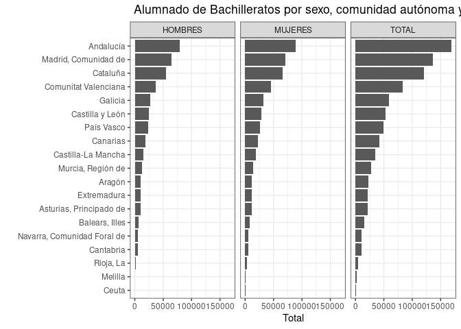

# *mefd_read*: Leer datos

La función *mefd_read* importa las bases de datos con indicadores en R.
Hay tres métodos diferentes para leer los datos. El primero es con el
argumento *idserie*, donde se indica el id del indicador, previamente
idenficado en los metadatos, *meta_mefd*. El segundo es con el argumento
*url_web*, donde se indica el vínculo de la web del MEFD donde están
depositados las series principales. El tercero es con el argumento
*url_ind*, el cual contiene uno o más *urls* asociados a las bases de
datos en formato *.csv* con los indicadores. A continuación demostramos
cada uno de estos métodos.

Comenzamos abriendo las librerías que vamos a necesitar para demostrar
esta función.

``` r
library(tidyverse)
library(mefdind)
```

## Método 1: Con el id de la serie (*idserie*)

Para implementar este método necesitamos primero saber el id del
indicador o indicadores que buscamos, por ejemplo, haciendo una búsqueda
con *meta_search*. Digamos que nos interesa el indicador con id *11109*.

``` r
df <- mefd_read(idserie = 11109)
```

En caso nos interesen varios indicadores, debemos incluir el id de la
siguiente manera.

``` r
df <- mefd_read(idserie = c(11109, 11125, 37002))
```

## Método 2: Con el vínculo de la web (*url_web*) \[[video](https://youtu.be/pdefiTIX7-I)\]

En este método, lo primero que hay que hacer es definir un objeto con la
dirección de la página web que con contiene la lista de indicadores. Por
ejemplo,

``` r
mi_url <-"https://estadisticas.educacion.gob.es/EducaDynPx/educabase/index.htm?type=pcaxis&path=/no-universitaria/centros/centrosyunid/series/unidades_esc&file=pcaxis&l=s0"
```

Luego, utilizando el argumento *url_web*, la función *mefd_read* lee
todas las bases de datos en la página web indicada y produce una lista,
*df*, con las *data.frames*.

``` r
df <- mefd_read(url_web = mi_url)
```

El nombre que identifica a los indicadores es el mismo al de los
archivos *.csv* que uno puede descargar desde la web del MEFD.

``` r
names(df)
#>  [1] "series_1_01.csv" "series_1_02.csv" "series_1_03.csv" "series_1_04.csv"
#>  [5] "series_1_05.csv" "series_1_06.csv" "series_1_07.csv" "series_1_08.csv"
#>  [9] "series_1_09.csv" "series_1_10.csv" "series_2_01.csv" "series_2_02.csv"
#> [13] "series_2_03.csv" "series_2_04.csv" "series_2_05.csv" "series_2_06.csv"
#> [17] "series_2_07.csv" "series_2_08.csv" "series_2_09.csv" "series_2_10.csv"
```

## Método 3: Con el url de la base de datos (*url_ind*) \[[video](https://youtu.be/_I0iiWYZrqc)\]

En este método vamos a poder seleccionar indicadores específicos a
partir de los metadatos utilizando el argumento *url_ind*. Hay dos
maneras de leer los datos con este método.

Una es utilizando los metadatos que son parte de este paquete,
*meta_mefd*.

``` r
glimpse(meta_mefd)
#> Rows: 271
#> Columns: 8
#> Groups: titulo_1, titulo_2, titulo_3 [15]
#> $ indicador <chr> " Alumnado de Enseñanzas de Régimen General por titularidad …
#> $ archivo   <chr> "alumnado_1_01.csv", "alumnado_1_02.csv", "alumnado_2_01.csv…
#> $ url       <chr> "https://estadisticas.educacion.gob.es/EducaJaxiPx/files/_px…
#> $ titulo    <chr> "ENSEÑANZAS NO UNIVERSITARIAS / ALUMNADO MATRICULADO / SERIE…
#> $ titulo_1  <chr> "Alumnado matriculado", "Alumnado matriculado", "Alumnado ma…
#> $ titulo_2  <chr> "Enseñanzas Régimen General", "Enseñanzas Régimen General", …
#> $ titulo_3  <chr> "Alumnado matriculado por enseñanza", "Alumnado matriculado …
#> $ idserie   <dbl> 11101, 11102, 11103, 11104, 11105, 11106, 11107, 11108, 1110…
```

La columna *indicador* contiene el nombre del indicador y la columna
*url* el url del archivo *.csv* con los datos.

Por ejemplo, así podemos leer el indicador en la fila *190*:

``` r
df <- mefd_read(url_ind = meta_mefd$url[190])
```

Si queremos seleccionar varios indicadores debemos ingresar el número de
las filas:

``` r
df <- mefd_read(url_ind=meta_mefd$url[c(1, 3, 5)])
```

Otra forma de usar este método es primero crear un *data.frame* con los
metadatos y luego leer con *mefd_read* utiilizando el argumento
*url_ind*.

Por ejemplo, imaginemos que hay una página nueva con indicadores que no
es parte de *meta_mefd*. Podemos crear los metadatos con la función
*mefd_meta*.

``` r
mi_url <-"https://estadisticas.educacion.gob.es/EducaDynPx/educabase/index.htm?type=pcaxis&path=/no-universitaria/alumnado/matriculado/series/gen-porcen-gen&file=pcaxis&l=s0"
df_meta <- mefd_meta(url_web = mi_url)
```

El objeto *df_meta* contiene los metadatos.

``` r
glimpse(df_meta)
#> Rows: 11
#> Columns: 4
#> $ indicador <chr> " Porcentaje de alumnado matriculado en centros públicos. To…
#> $ archivo   <chr> "general_01.csv", "general_02.csv", "general_03.csv", "gener…
#> $ url       <chr> "https://estadisticas.educacion.gob.es/EducaJaxiPx/files/_px…
#> $ titulo    <chr> "ENSEÑANZAS NO UNIVERSITARIAS / ALUMNADO MATRICULADO", "ENSE…
```

Luego seleccionamos los indicadores y leemos los datos con *mefd_meta*
utilizando el argumento *url_ind*, como lo hemos hecho anteriormente.
Así sería para los indicadores en las filas 3 y 7 de los metadatos:

``` r
df <- mefd_read(url_ind=df_meta$url[c(3, 7)])
```

## Visualización de datos

Finalmente, vamos a mostrar como visualizar los datos, tomando como
ejemplo un indicador específico:

``` r
meta_mefd$indicador[16]
#> [1] " Alumnado de Bachilleratos por sexo, comunidad autónoma y curso académico."
```

Vamos a leer los datos, calcular el promedio por comunicad autónoma y
formatear los datos para su visualización.

``` r
df <- mefd_read(url_ind = meta_mefd$url[16]) %>%
  filter(Comunidad.autónoma != "TOTAL") %>%
  mutate(Total = as.numeric(gsub('\\.', '', Total))) %>% # remover puntos
  group_by(Comunidad.autónoma, Sexo) %>%
  summarise(Total = mean(Total, na.rm = TRUE))
#> `summarise()` has grouped output by 'Comunidad.autónoma'. You can override
#> using the `.groups` argument.
```

Presentamos los resultados en un gráfico de barras

``` r
ggplot(df, aes(x = Total, y = reorder(Comunidad.autónoma, Total))) +
  geom_bar(stat = "identity") +
  ylab("") +
  theme_bw() +
  facet_wrap(~Sexo) +
  ggtitle(meta_mefd$indicador[16])
```


