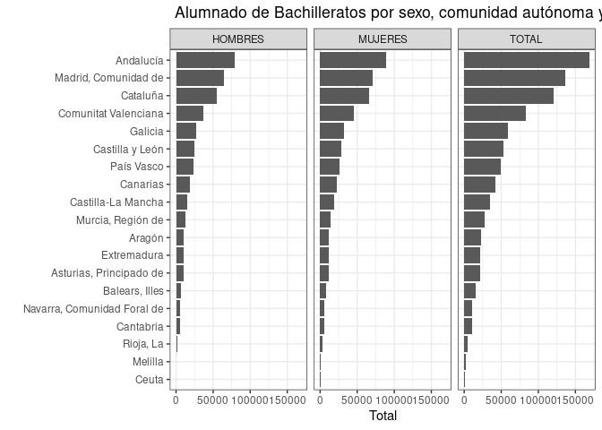

# *mefd_read*: Leer datos

La función *mefd_read* importa bases de datos con indicadores en R. Hay
tres métodos para leer los datos. El primero es con el argumento
*idserie*, el cual contiene el id del indicador, previamente idenficado
en la base de metadatos, *meta_mefd*, o con la función
[mefd_search](search.md) . El segundo es con el argumento *url_web*,
donde se indica la página web del MEFD que contiene las series
principales. El tercero es con el argumento *url_ind*, el cual contiene
uno o más *urls* con los datos en formato *.csv*. A continuación
demostramos cada uno de estos métodos.

Comenzamos abriendo las librerías que vamos a necesitar para demostrar
esta función.

``` r
library(tidyverse)
library(mefdind)
```

## Método 1: Con el id de la serie (*idserie*) \[[video](https://youtu.be/jv42mSNRQnA)\]

Para implementar este método necesitamos saber primero el id del
indicador que nos interesa en la base de metadatos *meta_mefd*.

Por ejemplo, digamos que ya tenemos un indicador identificado, cuyo
*idserie* es *11109*.

``` r
meta_mefd %>% 
  filter(idserie == 11109) %>% 
  select(indicador)
#>                                                                                          indicador
#> 1  Alumnado de E.G.B. de 7º y 8º por titularidad del centro, comunidad autónoma y curso académico.
```

Así podemos descargar los datos.

``` r
df <- mefd_read(idserie = 11109)
```

La data frame *df* contiene los datos del indicador.

``` r
head(df)
#>   Titularidad.del.centro Comunidad.autónoma periodo     Total
#> 1      TODOS LOS CENTROS              TOTAL 1996-97   454.384
#> 2      TODOS LOS CENTROS              TOTAL 1995-96 1.070.753
#> 3      TODOS LOS CENTROS              TOTAL 1994-95 1.141.297
#> 4      TODOS LOS CENTROS              TOTAL 1993-94 1.229.835
#> 5      TODOS LOS CENTROS              TOTAL 1992-93 1.273.792
#> 6      TODOS LOS CENTROS              TOTAL 1991-92 1.315.729
#>                                                                                          indicador
#> 1  Alumnado de E.G.B. de 7º y 8º por titularidad del centro, comunidad autónoma y curso académico.
#> 2  Alumnado de E.G.B. de 7º y 8º por titularidad del centro, comunidad autónoma y curso académico.
#> 3  Alumnado de E.G.B. de 7º y 8º por titularidad del centro, comunidad autónoma y curso académico.
#> 4  Alumnado de E.G.B. de 7º y 8º por titularidad del centro, comunidad autónoma y curso académico.
#> 5  Alumnado de E.G.B. de 7º y 8º por titularidad del centro, comunidad autónoma y curso académico.
#> 6  Alumnado de E.G.B. de 7º y 8º por titularidad del centro, comunidad autónoma y curso académico.
```

También es posible leer varios indicadores al mismo tiempo. Por ejemplo,
podemos usar la función [meta_search](search.md) para identificar
indicadores con una palabra clave.

``` r
(mi_id <- mefd_search("idoneidad"))
#>    idserie
#> 93   11501
#> 94   11502
#> 95   11503
#> 96   11504
#> 97   11505
#>                                                                                    indicador
#> 93   Tasas de idoneidad en la edad de 8 años por sexo, comunidad autónoma y curso académico.
#> 94  Tasas de idoneidad en la edad de 10 años por sexo, comunidad autónoma y curso académico.
#> 95  Tasas de idoneidad en la edad de 12 años por sexo, comunidad autónoma y curso académico.
#> 96  Tasas de idoneidad en la edad de 14 años por sexo, comunidad autónoma y curso académico.
#> 97  Tasas de idoneidad en la edad de 15 años por sexo, comunidad autónoma y curso académico.
```

Y luego leemos los datos insertando el id de la serie, *mi_id\$idserie*,
en el argumento *idserie*:

``` r
df <- mefd_read(idserie = mi_id$idserie)
```

En este caso, *df* es una lista con data frames para cada indicador.

También podemos leer indicadores específicos de la siguiente manera.

``` r
df <- mefd_read(idserie = c(11109, 11125, 37002))
```

## Método 2: Con el vínculo de la web (*url_web*) \[[video](https://youtu.be/pdefiTIX7-I)\]

En este método, lo primero que hay que hacer es definir un objeto con la
dirección de la página web que con contiene la lista de indicadores. Por
ejemplo,

``` r
mi_url <-"https://estadisticas.educacion.gob.es/EducaDynPx/educabase/index.htm?type=pcaxis&path=/no-universitaria/centros/centrosyunid/series/unidades_esc&file=pcaxis&l=s0"
```

Luego, utilizando el argumento *url_web*, la función *mefd_read* lee
todas las bases de datos en la página web indicada y produce una lista,
*df*, con las data frames.

``` r
df <- mefd_read(url_web = mi_url)
```

El nombre que identifica a los indicadores es el mismo al de los
archivos *.csv* que uno puede descargar desde la web del MEFD.

``` r
names(df)
#>  [1] "series_1_01.csv" "series_1_02.csv" "series_1_03.csv" "series_1_04.csv"
#>  [5] "series_1_05.csv" "series_1_06.csv" "series_1_07.csv" "series_1_08.csv"
#>  [9] "series_1_09.csv" "series_1_10.csv" "series_2_01.csv" "series_2_02.csv"
#> [13] "series_2_03.csv" "series_2_04.csv" "series_2_05.csv" "series_2_06.csv"
#> [17] "series_2_07.csv" "series_2_08.csv" "series_2_09.csv" "series_2_10.csv"
```

## Método 3: Con el url de la base de datos (*url_ind*) \[[video](https://youtu.be/_I0iiWYZrqc)\]

En este método vamos a poder leer directamente indicadores con el *url*
del archivo *.csv*.

Por ejemplo, imaginemos que hay una página nueva con indicadores que no
es parte de *meta_mefd*. Podemos crear los metadatos con la función
*mefd_meta*.

``` r
mi_url <-"https://estadisticas.educacion.gob.es/EducaDynPx/educabase/index.htm?type=pcaxis&path=/no-universitaria/alumnado/matriculado/series/gen-porcen-gen&file=pcaxis&l=s0"
df_meta <- mefd_meta(url_web = mi_url)
```

El objeto *df_meta* contiene los metadatos.

``` r
head(df_meta)
#>                                                                                                                                indicador
#> 1  Porcentaje de alumnado matriculado en centros públicos. Total Enseñanzas de Régimen General por comunidad autónoma y curso académico.
#> 2    Porcentaje de alumnado matriculado en centros públicos, por ciclo. E. Infantil/Preescolar por comunidad autónoma y curso académico.
#> 3                    Porcentaje de alumnado matriculado en centros públicos. E. Primaria/E.G.B por comunidad autónoma y curso académico.
#> 4                                  Porcentaje de alumnado matriculado en centros públicos. ESO por comunidad autónoma y curso académico.
#> 5         Porcentaje de alumnado matriculado en centros públicos, por enseñanza. Bachilleratos por comunidad autónoma y curso académico.
#> 6   Porcentaje de alumnado matriculado en centros públicos, por grado. Ciclos Formativos de FP por comunidad autónoma y curso académico.
#>          archivo
#> 1 general_01.csv
#> 2 general_02.csv
#> 3 general_03.csv
#> 4 general_04.csv
#> 5 general_05.csv
#> 6 general_06.csv
#>                                                                                                                                                                  url
#> 1 https://estadisticas.educacion.gob.es/EducaJaxiPx/files/_px/es/csv_bdsc/no-universitaria/alumnado/matriculado/series/gen-porcen-gen/l0/general_01.csv_bdsc?nocab=1
#> 2 https://estadisticas.educacion.gob.es/EducaJaxiPx/files/_px/es/csv_bdsc/no-universitaria/alumnado/matriculado/series/gen-porcen-gen/l0/general_02.csv_bdsc?nocab=1
#> 3 https://estadisticas.educacion.gob.es/EducaJaxiPx/files/_px/es/csv_bdsc/no-universitaria/alumnado/matriculado/series/gen-porcen-gen/l0/general_03.csv_bdsc?nocab=1
#> 4 https://estadisticas.educacion.gob.es/EducaJaxiPx/files/_px/es/csv_bdsc/no-universitaria/alumnado/matriculado/series/gen-porcen-gen/l0/general_04.csv_bdsc?nocab=1
#> 5 https://estadisticas.educacion.gob.es/EducaJaxiPx/files/_px/es/csv_bdsc/no-universitaria/alumnado/matriculado/series/gen-porcen-gen/l0/general_05.csv_bdsc?nocab=1
#> 6 https://estadisticas.educacion.gob.es/EducaJaxiPx/files/_px/es/csv_bdsc/no-universitaria/alumnado/matriculado/series/gen-porcen-gen/l0/general_06.csv_bdsc?nocab=1
#>                                                titulo
#> 1 ENSEÑANZAS NO UNIVERSITARIAS / ALUMNADO MATRICULADO
#> 2 ENSEÑANZAS NO UNIVERSITARIAS / ALUMNADO MATRICULADO
#> 3 ENSEÑANZAS NO UNIVERSITARIAS / ALUMNADO MATRICULADO
#> 4 ENSEÑANZAS NO UNIVERSITARIAS / ALUMNADO MATRICULADO
#> 5 ENSEÑANZAS NO UNIVERSITARIAS / ALUMNADO MATRICULADO
#> 6 ENSEÑANZAS NO UNIVERSITARIAS / ALUMNADO MATRICULADO
```

Digamos que nos interesan los indicadores en la fila 2 y 5. Así podemos
leer los datos.

``` r
df <- mefd_read(url_ind=df_meta$url[c(2, 5)])
```

## Visualización de datos

Finalmente, vamos a mostrar como visualizar los datos, tomando como
ejemplo un indicador específico:

``` r
meta_mefd %>% 
  filter(idserie == 11116) %>% 
  select(indicador)
#>                                                                    indicador
#> 1  Alumnado de Bachilleratos por sexo, comunidad autónoma y curso académico.
```

Vamos a leer los datos, calcular el promedio por comunicad autónoma y
formatear los datos para su visualización.

``` r
df <- mefd_read(idserie = 11116) %>%
  filter(Comunidad.autónoma != "TOTAL") %>%
  mutate(Total = as.numeric(gsub('\\.', '', Total))) %>% # remover puntos
  group_by(Comunidad.autónoma, Sexo) %>%
  summarise(Total = mean(Total, na.rm = TRUE))
#> `summarise()` has grouped output by 'Comunidad.autónoma'. You can override
#> using the `.groups` argument.
```

Presentamos los resultados en un gráfico de barras

``` r
ggplot(df, aes(x = Total, y = reorder(Comunidad.autónoma, Total))) +
  geom_bar(stat = "identity") +
  ylab("") +
  theme_bw() +
  facet_wrap(~Sexo) +
  ggtitle(meta_mefd$indicador[16])
```


